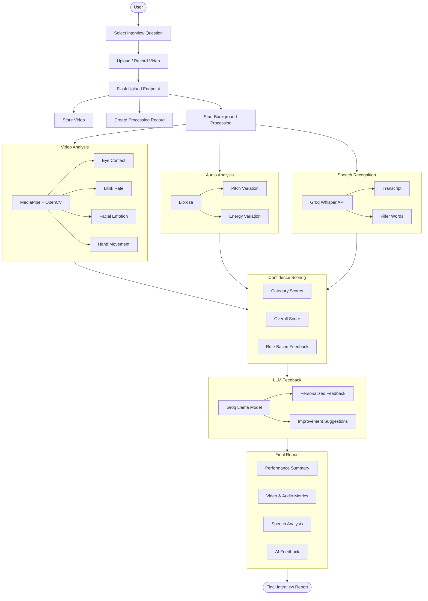

<p align="center">
  
</p>

**Face 2 Fate** is an AI-powered multi modal system that analyzes a candidate's interview performance and generates a confidence score with personalized feedback.

The application combines **computer vision, audio analysis, speech recognition, NLP system** to evaluate multiple aspects of interview communication.

---

## ✨ Features

### 🎥 Interview Experience
- Conduct mock video interviews with predefined interview questions
- Upload recorded interview videos for automated analysis
- Asynchronous background processing for efficient video analysis

### 👤 Visual & Behavioral Analysis
- 👁️ **Eye Contact Detection** — Measures eye-contact percentage
- 👀 **Blink Rate Analysis** — Tracks blinking frequency during the interview
- 😊 **Facial Emotion Recognition** — Identifies dominant emotions and emotional patterns
- ✋ **Hand Movement Analysis** — Evaluates hand gestures and movement patterns

### 🎙️ Voice & Speech Analysis
- 🎚️ **Pitch Variation Analysis** — Analyzes changes in vocal pitch
- 🔊 **Energy Variation Analysis** — Measures variations in speaking energy
- 📝 **Automatic Transcription** — Converts interview speech into text using Whisper
- 💬 **Filler Word Detection** — Identifies words such as *um, uh, like,* and other speech fillers

### 📊 Performance Evaluation
- **Overall Confidence Score** — Performance score ranging from **0–100**
- **Category-wise Scores** — Breaks performance into individual evaluation categories
- **Rule-based Feedback** — Generates feedback based on detected behavioral and speech patterns
- 📈 **Performance Breakdown** — Provides detailed visual and numerical analysis

### 🤖 AI-Powered Coaching
- **LLM-Generated Feedback** using the Groq Llama model
- Personalized interview coaching and improvement suggestions
- Combines video, audio, and speech analysis for contextual feedback

### 📄 Reports & Data Management
- 📜 **Interview Transcript** — View the complete generated transcript
- 📋 **Detailed Interview Report** — Combines all analysis results into a single report
- 🗄️ **MySQL Database** — Stores users, interview videos, analysis results, and generated reports
- 📚 **Interview History** — Track previous interview attempts and performance
---

## 🧠 How It Works

The complete processing pipeline is:

---

## 🛠️ Tech Stack

| Layer | Technology |
|---|---|
| Backend | Flask / Python |
| Database | MySQL |
| Computer Vision | OpenCV, MediaPipe Tasks |
| Face Tracking | MediaPipe FaceLandmarker |
| Hand Tracking | MediaPipe HandLandmarker |
| Emotion Recognition | HSEmotion ONNX |
| Audio Processing | Librosa |
| Audio Extraction | FFmpeg |
| Speech-to-Text | Groq Whisper (`whisper-large-v3-turbo`) |
| LLM Feedback | Groq Llama (`llama-3.3-70b-versatile`) |
| Frontend | HTML, CSS, JavaScript |
| Templates | Jinja2 |

---

## 📁 Project Structure

```text
Face-2-Fate/
│
├── 🚀 Application
│   ├── app.py                  # Flask application, routes, authentication & reports
│   ├── pipeline.py             # End-to-end video processing pipeline
│   └── utils.py                # Database, FFmpeg & shared utilities
│
├── 🧠 Analysis Modules
│   ├── video_analysis.py       # Face, eye, emotion & hand-movement analysis
│   ├── audio_analysis.py       # Pitch & energy variation analysis
│   ├── text_analysis.py        # Speech transcription & filler-word detection
│   └── confidence_score.py     # Confidence scoring & rule-based feedback
│
├── 🎨 Frontend
│   ├── templates/              # Jinja2 HTML templates
│   └── static/
│       ├── css/                # Stylesheets
│       ├── js/                 # JavaScript
│       └── images/             # Images & UI assets
│
├── 🤖 Models
│   └── models/                 # Local ML model files
│
├── 📦 Runtime Data
│   └── uploads/                # Temporary video/audio processing files
│
├── ⚙️ Configuration
│   ├── requirements.txt        # Python dependencies
│   ├── .env.example            # Environment variable template
│   ├── .gitignore              # Git ignore rules
│   ├── schema.sql              # MySQL database schema
│   └── download_models.sh      # Script to download MediaPipe model files
│
└── 📖 README.md                # Project documentation
```
---

## 📊 Confidence Score

The final confidence score is calculated on a **0–100 scale** using weighted components:

| Metric | Weight |
|---|---:|
| Eye Contact | 30% |
| Blink Rate | 20% |
| Filler Ratio | 20% |
| Emotion | 20% |
| Hand Movement | 10% |

The scoring system uses piecewise-linear scoring curves rather than simple pass/fail thresholds.

### Eye Contact

Eye contact is estimated using:

- Head pose from facial landmarks
- Yaw and pitch thresholds
- Iris position

The system considers approximately **70–85% eye contact** a strong range rather than simply rewarding maximum eye contact.

### Blink Rate

Blink rate is evaluated against a natural conversational range. The scoring curve rewards approximately **10–20 blinks per minute** and penalizes unusually low or high rates.

### Filler Words

The system analyzes the Whisper transcript and detects predefined filler expressions such as:

```text
um, uh, er, ah, hmm, like, right, sorta, kinda, basically, actually, well, so, okay, you know
```

The filler ratio is incorporated into the confidence score.

### Emotion

Facial emotion predictions are aggregated over the video and converted into an emotion distribution. Positive/neutral emotions contribute positively while negative emotions reduce the emotion component of the score.

### Hand Movement

Hand movement is measured from MediaPipe hand landmarks and evaluated using a scoring curve that favors moderate movement.

---

## 🔍 Video Analysis

The video-analysis module processes the interview frame by frame.

### Face Analysis

MediaPipe FaceLandmarker is used to obtain facial landmarks.

The application uses these landmarks for:

- Eye Aspect Ratio (EAR)
- Blink detection
- Head-pose estimation
- Eye-contact estimation
- Face cropping for emotion recognition

### Emotion Recognition

Facial crops are passed to the HSEmotion ONNX model:

```text
models/enet_b0_8_best_afew.onnx
```

The dominant emotion from sampled frames is aggregated into a normalized distribution.

### Hand Tracking

MediaPipe HandLandmarker detects hands and calculates movement using the displacement of hand landmark centroids between sampled frames.

---

## 🎙️ Audio Analysis

The video audio is extracted using FFmpeg into a:

```text
16 kHz
Mono
PCM WAV
```

file.

Librosa is then used to calculate:

### Pitch Variation

Fundamental frequency is extracted using YIN.

```text
pitch_variation = standard deviation of F0 / mean F0
```

### Energy Variation

RMS energy is used to estimate variation in speaking loudness.

Pitch and energy currently contribute to **qualitative feedback**, rather than the numeric confidence score.

---

## 📝 Speech & NLP Analysis

The extracted audio is sent to Groq's Whisper API using:

```text
whisper-large-v3-turbo
```

The application requests word-level timestamps to support filler-word detection.

The resulting data includes:

- Full transcript
- Filler events
- Filler count
- Start/end timestamps

---

## 🗄️ Database

The application uses MySQL with the database:

```text
emotion_aware
```

The main entities are:

```text
users
   │
   └── video
          │
          ├── video_analysis
          ├── audio_analysis
          ├── text_analysis
          └── report
```

### Main Tables

#### `users`

Stores user authentication information.

#### `video`

Stores uploaded interview videos and processing status.

#### `video_analysis`

Stores:

- Eye-contact percentage
- Blink rate
- Emotion distribution
- Hand movement

#### `audio_analysis`

Stores:

- Duration
- Energy variation
- Pitch variation

#### `text_analysis`

Stores:

- Transcript
- Filler events
- Filler count

#### `report`

Stores:

- Overall score
- Category breakdown
- LLM-generated feedback

---

## ⚙️ Installation

### 1. Clone the repository

```bash
git clone https://github.com/YOUR_USERNAME/Face-2-Fate.git
cd Face-2-Fate
```

### 2. Create a virtual environment

Windows:

```bash
python -m venv venv
venv\Scripts\activate
```

Linux/macOS:

```bash
python3 -m venv venv
source venv/bin/activate
```

### 3. Install dependencies

```bash
pip install -r requirements.txt
```

### 4. Install FFmpeg

FFmpeg must be installed and available in your system PATH.

Verify:

```bash
ffmpeg -version
```

### 5. Configure environment variables

Create a `.env` file based on `.env.example`.

Example:

```env
GROQ_API_KEY=your_groq_api_key

DB_HOST=localhost
DB_USER=root
DB_PASSWORD=your_password
DB_NAME=emotion_aware
DB_PORT=3306

FLASK_SECRET_KEY=your_secret_key
```

Do **not** commit your actual `.env` file.

---

## 🧩 Required ML Models

The application requires the following model files:

```text
face_landmarker.task
hand_landmarker.task
models/enet_b0_8_best_afew.onnx
```

Place them in the paths expected by the application.

These model files are intentionally excluded from Git tracking because of their size and/or distribution considerations.

### Download Links

| Model | Download |
|---|---|
| `face_landmarker.task` | [MediaPipe Face Landmarker (float16)](https://storage.googleapis.com/mediapipe-models/face_landmarker/face_landmarker/float16/latest/face_landmarker.task) |
| `hand_landmarker.task` | [MediaPipe Hand Landmarker (float16)](https://storage.googleapis.com/mediapipe-models/hand_landmarker/hand_landmarker/float16/latest/hand_landmarker.task) |
| `enet_b0_8_best_afew.onnx` | [HSEmotion model repo](https://github.com/HSE-asavchenko/face-emotion-recognition) — see `models/affectnet_emotions/onnx` in that repo and check the license before redistributing |

Quick download for the two MediaPipe models — a script is included in the repo for this:

```bash
chmod +x download_models.sh
./download_models.sh
```

This downloads `face_landmarker.task` and `hand_landmarker.task` into the project root automatically. It does **not** download the HSEmotion ONNX model — you'll still need to grab `enet_b0_8_best_afew.onnx` manually from the link above and place it at `models/enet_b0_8_best_afew.onnx`.

Alternatively, download the two MediaPipe models manually:

```bash
curl -L -o face_landmarker.task https://storage.googleapis.com/mediapipe-models/face_landmarker/face_landmarker/float16/latest/face_landmarker.task
curl -L -o hand_landmarker.task https://storage.googleapis.com/mediapipe-models/hand_landmarker/hand_landmarker/float16/latest/hand_landmarker.task
```

> **Note:** since these files aren't in the repo, you'll need to obtain them (via the script/links above, or from the original project owner / a release asset / Git LFS) and place them at the exact paths shown before running the app.


---

## 🗃️ MySQL Setup

Create a MySQL database named:

```sql
CREATE DATABASE emotion_aware;
```

The application expects tables for:

```text
users
video
video_analysis
audio_analysis
text_analysis
report
```

A `questions` table is also required by the application for the interview-question flow.

Make sure your database configuration in `.env` matches your local MySQL installation.

---

## ▶️ Running the Application

Start the Flask application:

```bash
python app.py
```

The application runs using the Flask development server.

Open the local URL shown by Flask in your browser.

---

## 🔄 Processing Status

Video processing occurs in a background thread.

The upload endpoint immediately returns a processing status and video ID.

The frontend then polls:

```text
/status/<v_id>
```

until processing is complete.

Once processing finishes, the user is redirected to:

```text
/report/<v_id>
```

---

## 📄 Report

The generated report contains:

- Overall confidence score
- Eye-contact score
- Blink-rate score
- Filler-word score
- Emotion score
- Hand-movement score
- Pitch feedback
- Energy feedback
- LLM-generated coaching feedback
- Interview transcript

---

## 🚧 Current Limitations

- Processing currently uses a background thread rather than a dedicated job queue.
- Filler-word detection is keyword-based and may classify some normal conversational words as fillers.
- Pitch and energy are currently used for feedback but not included in the numerical score.
- Model files must be supplied separately.
- The project is primarily designed as a prototype/demo application rather than a production deployment.
- Video quality can affect computer-vision measurements.
- External Groq API availability affects transcription and AI-generated feedback.

---

## 🔮 Future Improvements

Potential improvements include:

- Real-time interview analysis
- Better context-aware filler-word detection
- More robust emotion recognition
- Posture and body-language analysis
- Improved voice-quality analysis
- Dedicated task queue such as Celery/RQ
- Real-time processing status updates
- More sophisticated confidence scoring
- Production-grade authentication and authorization
- Automated model download/setup
- Docker-based deployment
- Cloud deployment
- Expanded interview question bank
- Performance history and analytics dashboard

---

## 🎯 Conclusion

Face 2 Fate aims to help candidates practice interviews by converting observable interview behaviors into actionable feedback.

Instead of evaluating only the **content of an answer**, the system analyzes multiple communication signals:

```text
Facial Behavior
      +
Body Movement
      +
Voice Characteristics
      +
Speech Patterns
      +
Emotional State
      ↓
Confidence Score
      ↓
AI Coaching Feedback
```

---
